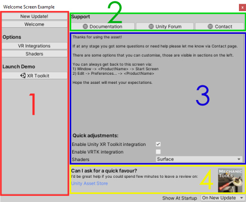

# Asset Store Publisher Tools for Unity - Usage Analytics Dashboard / Product Welcome Screen
[](https://youtu.be/3sUf7Qlx8gE)
*click to open in Youtube*

## Asset Usage Analytics
Have you ever wanted to understand the usage of your Unity Asset better? Stats like:
- how many different users?
- how often it's being used?
- how long specific user has been using it?

Sure, you can get purchase stats but there's very little around actual usage.

That data could give you more insight into asset performance, user retention, etc

Perhaps you'd also want to **communicate with the user?** 
- maybe send them a quick note around new update?
- ask for opinion on new feature?

While you can do that via Unity Forum / your website there's nothing like direct message that they can see in front of them. 

This tool will give you exactly that while at the same time providing you with easy to use and configure product welcome screen.

> **Before turning analytics on it'd be good idea to add a note on main screen that launch data will be capured. User is anonymous, the only bit of information sent is ID generated and saved in EditorPerfs that'll be used to tie all web-calls together.**

> Analytics and message delivery is accomplished by update-check done by welcome screen on Unity startup. **More on setting up analytics in following sections.**

## Customisable Product Welcome Screen
I bet you've used plenty of Unity Store Assets with quality ranging from total waste of time to something that feels like it should be shipped with Unity installation.

The ones that make great impression have few things in common:
- Usable from first launch (no matter your setup) without headache of adjusting code
- Easy to configure for your needs
- When everything goes wrong support is solid and easy to find, be it documentation or contacting developer

This tool will help you with getting there:
- Make great first impression on your asset user
    - Automatically configure asset to be used with their setup 
        - eg. adjust shaders based on current project setup
    - Allow users to easily configure specific asset options for their needs
        - eg. allow to turn specific 3rd integrations on/off by automatically applying build symbols, this means you can ship all those integrations in main asset pack without user needing to import specific files 
    - Give them all details needed
        - from resources like documentation, website page
        - to easy direct support
- Save lots of time: little coding on your part, **just provide your content** and some basic handler code
- Easily communicate with end-users
    - send messages directly to users
        - could be sending new release info
        - **asking to leave a review on asset store** (perhaps while also offering a discount on your next product)
- Track your unity asset usage
    - understand if people are actually working with your product (as opposed to just knowing someone bought it)
    - helps to identify returning users - they could provide you with insight to make your product better
        - perhaps you could even nudge them to chat via quick message
    
## Easy Setup


1) Copy and include `Editor/WelcomeScreen` folder into your asset
> You can also compile code in to DLL as this contains base classes / common functionality, since this is asset that you distribute - I found it best to include as source code.
2) Copy `ExampleWelcomeScreen.cs` file to your project (this includes screen customisable screen initialization code)
3) Customisable parts, eg name, section, etc are in region `CustomisablePerProduct` in all 3 classes. Please adjust as needed (more options in later sections)
    - to begin with analytics all you need to provide is:
        - `AnalyticsVerificationToken` - generated via [web-application](https://app.immersiveVRtools.com/#/signup)
        - `ProjectId` - unique ID (used for analytics and PerfSettings prefix) 
*Use only letters(a-z) and dashes(-)*
> Code in `RequiredSetupCode` regions is adding window / preferences to Unity Editor - it's best to left unchanged.
4) Done - you'll now have functional and professionally looking welcome screen that'll add analytics and communication ability to your asset/

### `Weclome Screen` class
Basic project information as well as content definitions can be found here (region `CustomisablePerProduct`).

#### General
- `IsUsageAnalyticsAndCommunicationsEnabled` - this will enable usage analytics and 
- `AnalyticsVerificationToken` - this is token generated via [web-application](https://app.immersiveVRtools.com/#/signup) [more info in section `Set up Analytics`]
- `ProjectId` - unique ID (used for analytics and PerfSettings prefix) 
*Use only letters(a-z) and dashes(-)*
- `VersionId` - current product version (will help determine which users updated your asset to newest version)
- `ProductName` - shows as a secion name in Preferences, as well as window title
- `StartWindowMenuItemPath` - access to welcome screen is available via top-bar in Unity, this specifies path
- `ProductKeywords` - keywords used by Quick Search
- `ProjectIconName` - 64x64 product icon that'll be visible in bottom right corner

#### Layout
- `_WindowSizePx` - width and height of your window
- `LeftColumnWidth` - window is in 2 column layout - this value controls widht of 'menu' (left side)

#### Section Definitions

Screen GUI is composed of 4 sections as on the image.

##### 1) [RED] - Navigation Menu (left column)

You can put various 'pages' to the menu, user will be able to click on it and that'd in turn show some content in `MainSection` and/or execute some code. 

Sample Usage:
- provide documentation pages
- segment settings to make setup simpler
- launch a demo scene

Example definition:
```
private static readonly List<GuiSection> LeftSections = new List<GuiSection>() {
    new GuiSection("Options", new List<ClickableElement>() {
        new ChangeMainViewButton("Shaders", (screen) =>
        {
            //This code will be executed when user clicked on 'Shaders' menu options - it's standard UnityEditorUI code

            //Create label with text using TextStyle (small, standard text)
            GUILayout.Label(
                @"By default package uses HDRP shaders, you can change those to standard surface shaders from dropdown below",
                screen.TextStyle
            );

            //200 label width to create additional space between label and dropdown box
            using (LayoutHelper.LabelWidth(200))
            {
                //Use RenderGuiAndPersistInput for ShaderModePreferenceDefinition, more on that later, editor definition knows what type of input to render, dropdown, text, etc...
                ProductPreferenceBase.RenderGuiAndPersistInput(WelcomeScreenPreferences.ShaderModePreferenceDefinition);
            }
        })
    })
};
```

Code will add a section called `Options` with button `Shaders` that upon clicking will open page `MainView` with text `By default package uses HDRP shaders, you can change t...` and will allow user to tweak `Shader` preference via dropdown

> More on available classes in `Available Section Definition Actions` section.

##### 2) [GREEN] - Links/Actions Section (top, right column)

This is short buttons/actions section that's placed in right column. Items will be placed on same line.

Generally used for:
- various easy to access links
    - support forum
    - contact

Example definition:
```
private static readonly GuiSection TopSection = new GuiSection("Support", new List<ClickableElement>
    {
        new OpenUrlButton("Documentation", $"https://your-url.com/documentation"),
        new OpenUrlButton("Unity Forum", $"https://your-url.com/unity-forum"),
        new OpenUrlButton("Contact", $"https://your-url.com/contact")
    }
);
```

Definition will add `Support` section with 3 links `Documentation` / `Unity Forum` / `Contact` those will open a browser for user.

##### 3) [BLUE] - Main Content Section (center, right column)

This is what will show upon startup.

Example definition:
```
    private static readonly ScrollViewGuiSection MainContentSection = new ScrollViewGuiSection(
        "", (screen) =>
        {
            GenerateCommonWelcomeText(ProductName, screen);

            GUILayout.Label("Quick adjustments:", screen.LabelStyle);
            using (LayoutHelper.LabelWidth(220))
            {
                ProductPreferenceBase.RenderGuiAndPersistInput(WelcomeScreenPreferences.EnableXrToolkitIntegrationPreferenceDefinition);
                ProductPreferenceBase.RenderGuiAndPersistInput(WelcomeScreenPreferences.EnableVrtkIntegrationPreferenceDefinition);
                ProductPreferenceBase.RenderGuiAndPersistInput(WelcomeScreenPreferences.ShaderModePreferenceDefinition);
            }
        }
    );
```
As simple as that a welcome text with some basic info will be displayed, additionally some `Quick Adjustments` menu will be shown that'll allow to easily configure often-used preferences

##### 4) [YELLOW] - Bottom Section (bottom, right column)

Small bottom section for additional content that you'd like to be visible on every page. It can also feature small 64x64px icon of your product.

Example definition:
```
private static readonly GuiSection BottomSection = new GuiSection(
    "Can I ask for a quick favour?",
    $"I'd be great help if you could spend few minutes to leave a review on:",
    new List<ClickableElement>
    {
        new OpenUrlButton("  Unity Asset Store", $"<your asset store link>"),
    }
);
```
Hopefully this will get them to write that review...


##### Last Update Text Section (same as Main Content)
This section will replace `MainContent` when there's a message available for user. It'll only be displayed once after which is considered 'read'. By default it's just text but you can adjust to include anything that's needed. Access to last update text via `screen.LastUpdateText`

Exaple definition:
```
private static readonly ScrollViewGuiSection LastUpdateSection = new ScrollViewGuiSection(
    "New Update", (screen) =>
    {
        GUILayout.Label(screen.LastUpdateText, screen.BoldTextStyle, GUILayout.ExpandHeight(true));
    }
);
```

### `Weclome Screen Preferences` class
You may have some settings that'll make your product to behave differently, those are usually adjusted by end-users as needed. Tool will allow you to simply define Preference name, type and perhaps some `OnChange` handle code. 

That's it, you no longer have to add code to render that on screen, based on type default input (eg. enum / text / etc) will be created.

Preferences can be accessed directly and easily from within your `Window` code or via Unity (`Edit -> Preferences -> Your product name`)


*Auto Generated Preferences Section*

Examples:
```
    public static readonly ToggleProjectEditorPreferenceDefinition EnableXrToolkitIntegrationPreferenceDefinition = new ToggleProjectEditorPreferenceDefinition(
        "Enable Unity XR Toolkit integration", "XRToolkitIntegrationEnabled", true,
        (newValue, oldValue) =>
        {
            BuildDefineSymbolManager.SetBuildDefineSymbolState(BuildSymbol_EnableXrToolkit, (bool)newValue);
        });
```
This will create a simple toggle that'll add or remove specific build-symbol. The end result is you can for example add all 3rd party integration specific code to your asset and simply allow user to only enable it once depedencies are imported. No more build errors after import or importing specific files.

Default value for this will be: `true`.

Of couse you can create any handler you want.

```
public static readonly EnumProjectEditorPreferenceDefinition ShaderModePreferenceDefinition = new EnumProjectEditorPreferenceDefinition("Shaders",
    "ShadersMode",
    ShadersMode.HDRP,
    typeof(ShadersMode),
    (newValue, oldValue) =>
    {
        if (oldValue == null) oldValue = default(ShadersMode);

        var newShaderModeValue = (ShadersMode)newValue;
        var oldShaderModeValue = (ShadersMode)oldValue;

        if (newShaderModeValue != oldShaderModeValue) 
        {
            SetCommonMaterialsShader(newShaderModeValue);
        }
    }
);
```
This will create a dropdown with ``ShadersMode`` enum values.

Default value for this will be: `ShadersMode.HDRP`.

### WelcomeScreenInitializer class
You can easily add any custom code that needs to run when your product window is opened, eg.
- first imported
- update is added
- opened by user 

This is very good opportunity to check that tool is ready to work with user setup and perform any automatic setup actions needed. `isFirstRun` parameter will provide information if it's first run of run your asset with that project.

Example:
```
public static void RunOnWindowOpened(bool isFirstRun)
{
    AutoDetectAndSetShaderMode();
}
```

## Set up Analytics


You can very easily enable analytics which will give you the ability to see some more datailed data around your asset usage.

> If enabled asset will check for update on every Unity startup, it'll also create unique user ID that is then used to connect user activity. Users can turn off this behaviour by setting `Show at Startup' from `On New Update` to `Never`.

1) Go to https://app.immersiveVRtools.com/#/signup
2) Fill the details
3) An email with activation link will be sent to you, just follow it and you'll be able to set your password.
4) You'll then be directed to dashboard, on top of the page you'll find your verification-token

5) Use that token as value for `AnalyticsVerificationToken` in `ExampleWelcomeScreen.cs`
    - set `IsUsageAnalyticsAndCommunicationsEnabled` to true
6) Import your asset into new Unity project and test, once run you should see a new project on the dashboard

## Communication with your asset users


Once you're registered for analytics a new functionality is possible, you can now create messages for specific users. Those messages will be displayed directly to them when they launch project with your asset in it.

You'll also get a delivery receipt via website.

## Extending Code
Code is sturctured in a easy to extend w ay.

### GUI Components
GUI is composed automatically with specific types having different rendering and behaviour.

- `GuiSectionBase` - That's a parent layout class used to render your content
    - `ScrollViewGuiSection` - renders as a scroll view where you can add additional UnityGUI code to create more form controls
    - `GuiSection` - standard section with a list of `ClickableElements`
- `ClickableElement` - base for various GUI elements that user can interact with
    - `ChangeMainViewButton` - upon clicking your Unity GUI code will be rendered in main view area
    - `OpenUrlButton` - opens specified URL (will additionally render with specific icon 'BuildSettings.Web.Small')
    - `OpenUrlLink` - opens specified URL, renders without icon
    - `LaunchSceneButton` - will open specified scene

> Additional base class implementation can be easily created to support more actions.

### Project Preference Definition
Project preferences are rendered automatically using specified input type. Upon change they are saved via EditorPrefs class for specified project. A default value is also assigned on initialization. This should simplify management of your asset settings.

- `ProjectEditorPreferenceDefinitionBase` - base class for project preference definitions
    - `TextProjectEditorPreferenceDefinition` - rendered as text input
    (todo add image)
    - `ToggleProjectEditorPreferenceDefinition` - rendered as checkbox
    (todo add image)
    - `EnumProjectEditorPreferenceDefinition` - rendered as enum for all values

> Additional base class implementation can be easily created to support more inputs.

### Roadmap
- Link redirection (eg static link for support that'll be configured via web-application. This will also enable link click analytics)
- 2 way communication 
    - eg. for support purposes
- automatic GUI definition creation / adjustments